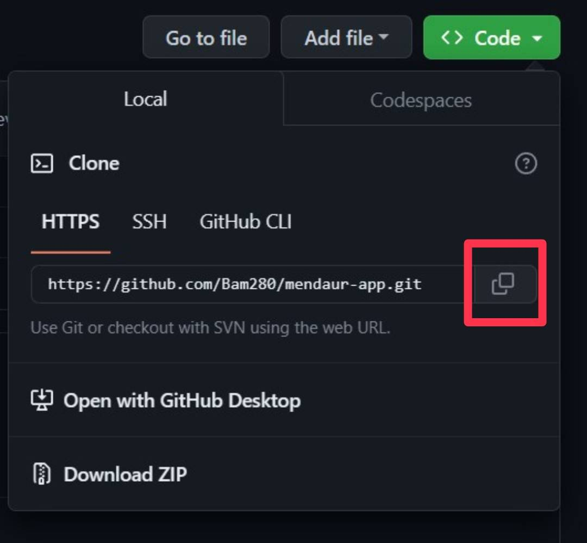

# Machine Learning

## Meet Our Machine Learning Team!
| ID | Name | Scope of Tasks  |
| ----------| --- | ---------- |
| M169DSX1318 | Naufal Mu’afi | Developing CNN model |
| M181DSX0325 | Kelvin Erlangga | Gathering recycle data, Developing Resnet50 Model, Creating Model Deployment Code  |
| M151DSX2483 | Arifful Fikri | Gathering images data, Developing VGG16 Model  |

## Forking and Cloning Your Local Model to GCP
### Forking Our Repository
1. Fork the repository.  

### Cloning Your Forked Repository
1. Clone the repository.  

### Dataset Link
1. [Garbage_classification.zip](https://drive.google.com/file/d/16KiEYXwuOs8ZvEGLrjxpbg_sZn4L_8zP/view?usp=sharing)
2. [recycle_recommendation.json](https://drive.google.com/file/d/1xGcEeIwl4ind9zuZYNwl3uObyfM9crt8/view?usp=sharing)

### Model Deployment
1. Open `Machine Learning/deployment` folder  
2. Run the following command, 
    - `pip install -r requirements.txt`
    - `python main.py`

## Deploying Your Local Model to GCP
Here is step-by-step of how to deploy the docker container on GCP:
1. Follow [Forking and and Cloning Your Local Model to GCP](#forking-and-cloning-your-local-model-to-gcp) and open `Machine Learning/deployment` folder.
2. Create new project in GCP and activate Cloud Run API and Cloud Build API
3. Initialize Google Cloud CLI (by running the following command `gcloud init` on terminal). To do this, you must first install gcloud CLI by following the instruction on this [link](https://cloud.google.com/sdk/docs/install)
4. Run the following command and replace PROJECT_ID to your project id on GCP, `gcloud config set project PROJECT_ID`
5. Use command `gcloud run deploy`
    1. When you are prompted for the source code location, press Enter to deploy the current folder.
    2. When you are prompted for the service name, press Enter to accept the default name, for example helloworld.
    3. If you are prompted to enable the Artifact Registry API or to allow creation of Artifact Registry repository, respond by pressing `y`.
    4. When you are prompted for region: select the region of your choice, for example us-central1.
    5 You will be prompted to allow unauthenticated invocations: respond `y`
6. Visit the deployed service. You can check the service on GCP by using cloud run feature.

---
Resources:
- https://cloud.google.com/run/docs/quickstarts/build-and-deploy/deploy-python-service
- https://www.youtube.com/watch?v=vieoHqt7pxo