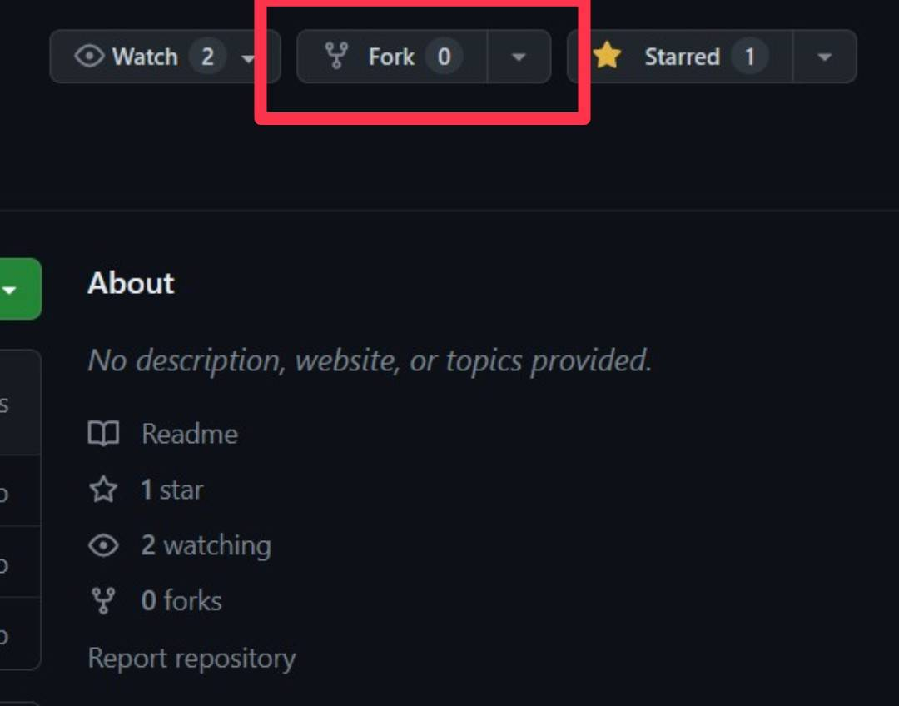
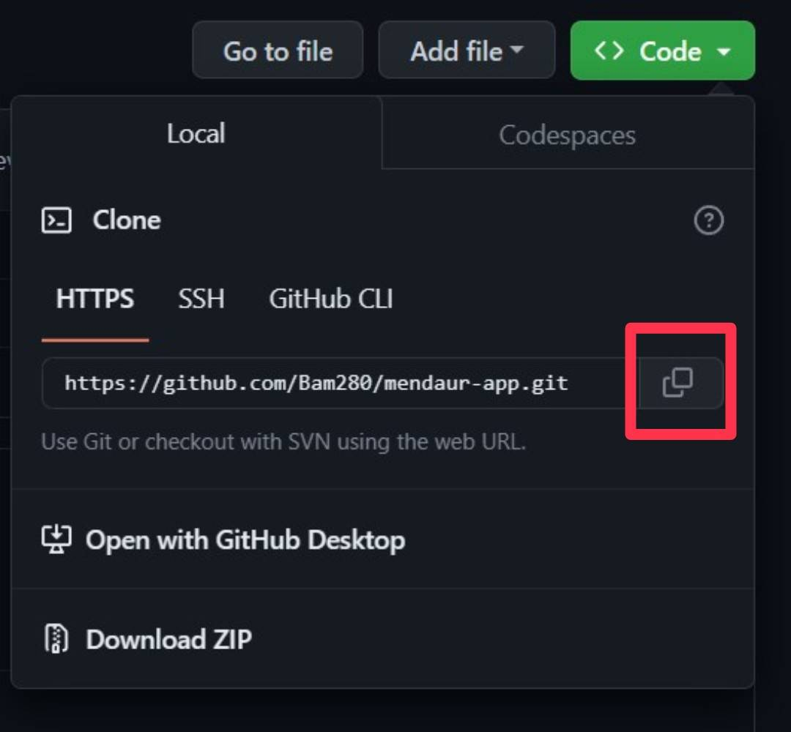

# Mobile Development

## Meet Our Mobile Development Team!
| ID | Name | Scope of Tasks  |
| ----------| --- | ---------- |
| A304DSX1096 | Abednego Christianyoel Rumagit | Develop Mendaur App |

## Android Architecture
- MVVM Architecture

   

## Our Features
- Splash Screen
- Login
- Waste Detection
- Recycle recommendation
- Nearby Bank Sampah
- Articles and Post Article
- Report for prediction error
- Multi Languages

## Libraries and Dependecies Used
- CameraX
- Firebase (Authentication and Firestore)
- Glide
- Google Play Services Maps and Location
- hdodenhof Circle Image View
- LiveData and ViewModelScope
- Material Design
- Navigation Components
- Retrofit 2 and OKHTTP3

## Application Download Link
Mendaur APK download link:  
[mendaurAPK](https://drive.google.com/file/d/16uyQGY4ysvd5p9uPRLPdoDVXqxMaI4SI/view?usp=sharing)

## Installation
1. Make sure you have already installed Android Studio.
2. Fork and Clone this Project
   - Fork the repository.   
   - Clone the repository.   
3. Get your Maps API Token on this [link](https://console.cloud.google.com/).
4. Paste your Maps API Token to [YOUR_API_KEY] on
   - AndroidManifest.xml   
   `android:value="[YOUR_API_KEY]"`
   - string.xml  
   `<string name="API_KEY">[YOUR_API_KEY]</string>`
5. Run the application.
