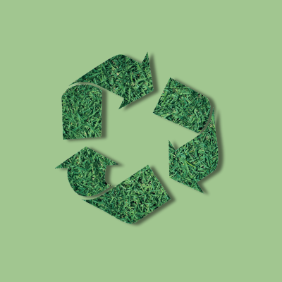

# MenDaur: Bangkit C23-PR537 Product Capstone Project
Hello, Everyone! We are from C23-PR537 team, consisting of 1 Mobile Development, 2 Cloud Computing, and 3 Machine Learning student. Here is our repository for MenDaur project. MenDaur is a Bangkit 2023 capstone project with the theme of sustainable living by utilizing FastAPI as the backend and Android (Kotlin) as the frontend.

## Meet our team!
| ID | Name | Learning Path  |
| ----------| --- | ---------- |
| A304DSX1096 | Abednego Christianyoel Rumagit | Mobile Development |
| C172DKX4165 | Anden Nirboyo | Cloud Computing |
| C304DSX1945 | Rivardi | Cloud Computing |
| M169DSX1318 | Naufal Mu’afi | Machine Learning |
| M181DSX0325 | Kelvin Erlangga | Machine Learning |
| M151DSX2483 | Arifful Fikri | Machine Learning |

## What is MenDaur?
Mendaur is an application that can detect organic and inorganic garbage and provides recycling advice. Mendaur's advanced waste detection system helps clients choose recycling options. Mendaur recycles non-organic waste and locates convenient waste disposal locations. This tool helps users identify disposal centers, promoting waste management and lowering environmental effects.

### How does this app work?
&nbsp; &nbsp;
&nbsp; &nbsp;
&nbsp; &nbsp;
&nbsp; &nbsp;

### What happened behind this app?

### Try out our app!
If you want to know more about this app, you can download it [here](https://drive.google.com/file/d/16uyQGY4ysvd5p9uPRLPdoDVXqxMaI4SI/view?usp=sharing).

## Important Links
### Datasets
You can access our used public datasets on the following links:
1. [Garbage_classification.zip](https://drive.google.com/file/d/16KiEYXwuOs8ZvEGLrjxpbg_sZn4L_8zP/view?usp=sharing)
2. [recycle_recommendation.json](https://drive.google.com/file/d/1xGcEeIwl4ind9zuZYNwl3uObyfM9crt8/view?usp=sharing)

### API Documentation
You can access our API Documentation on the following links: [Deployed API docs](https://mendaur-app-c5tvvxbrdq-et.a.run.app/docs)

### UI/UX Design
You can access our prototype design on the following links: [UI/UX Design](https://www.figma.com/file/7zdAOKZkXlpJuOeCJTVDjJ/UI%2FUX-MenDaur?type=design&node-id=1%3A2&t=4PGFJPzENDeVDOEZ-1)

### Repository (check it out if you want to replicate our steps)
| Learning Path  | Branch Name | Branch Link |
| ---------- | ----------- | ----------- |
| Mobile Development | mobile-development | [MD Branch](https://github.com/Bam280/mendaur-app/tree/mobile-development) |
| Cloud Computing | cloud-computing | [CC Branch](https://github.com/Bam280/mendaur-app/tree/cloud-computing) |
| Machine Learning | machine-learning | [ML Branch](https://github.com/Bam280/mendaur-app/tree/machine-learning) |